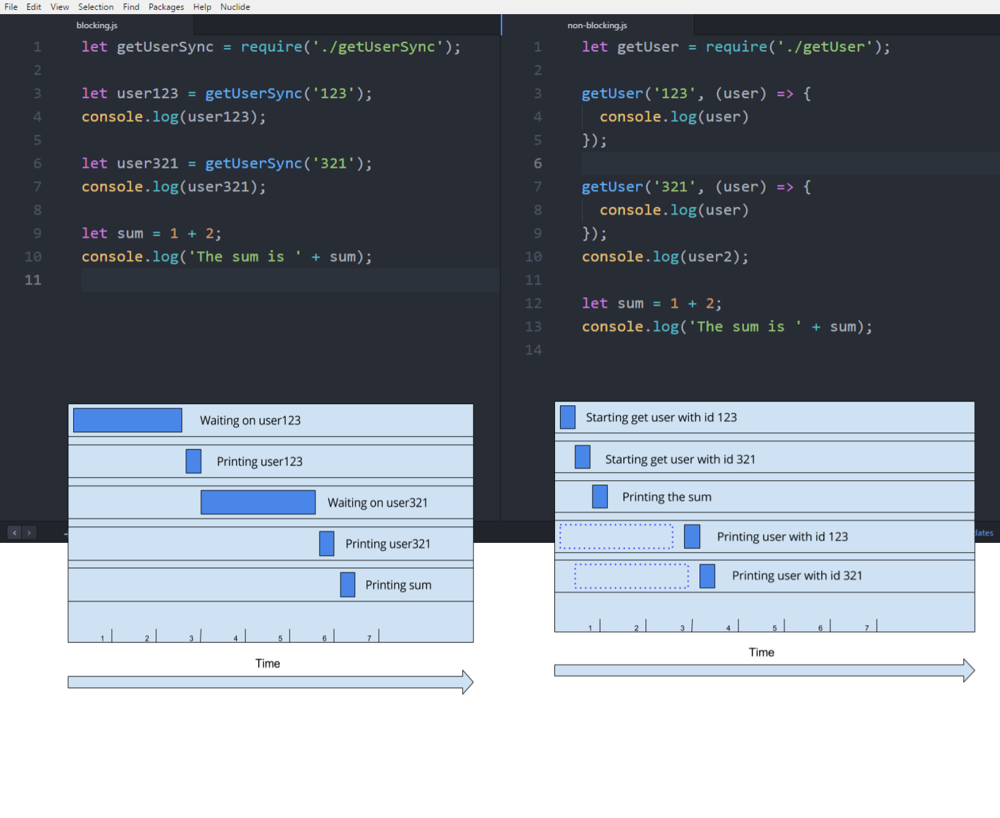

# Blocking vs non-blocking code

* When learning Node.js you will hear people talking about
**blocking** vs **non-blocking** calls.

* Understanding **blocking** and **non-blocking** calls in Node.js is an important step to efficiently learn how to write Node.js applications.

<p text-align="center">
  
</p>

## Blocking

* Blocking is when the execution of additional JavaScript in the Node.js program must wait until a **non-JavaScript** operation completes.

* Non-JavaScript operations generally is an I/O opertaion such as
  - updating/Reading from a file on the hard drive.
  - Updating/Reading from a database.
  - Requesting articles from NewYrokTimes API.


* Blocking methods execute **synchronously**.

* Non-blocking methods execute **asynchronously**.

* All of the I/O methods in the Node.js standard library provide **asynchronous** versions, which are
  - **non-blocking**
  - accept callback functions


Example - **synchronous**/**blocking** file read

```javascript
const fs = require('fs');
const data = fs.readFileSync('./data.txt'); // blocks here until file is read
console.log(data)

console.log('work complete')//will run after console.log
```

In the example above, **console.log** will be called before **moreWork()**.

Example - **asynchronous**/**non-blocking** file read

```javascript
const fs = require('fs');
fs.readFile('./file.txt', (err, data) => {
  if (err) throw err;
  console.log(data)
});

console.log('work complete')// will run before console.log
```

* **fs.readFile()** is **non-blocking** so JavaScript execution can continue and **console.log('work complete')** will be called first.

## Exercise

Download the two node programs.

[blocking.js](./palyground/2-blocking-vs-nonblocking/blocking.js)  
[non-blocking.js](./palyground/2-blocking-vs-nonblocking/non-blocking.js)

After running the programs, try to draw an execution time line like the one above.
